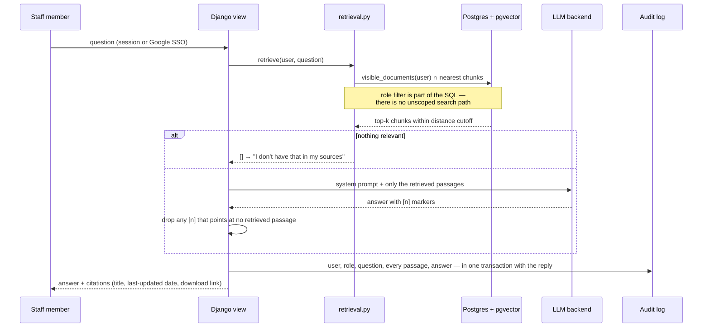

# District Brain

[](https://github.com/ZachRouan/district-brain/actions/workflows/ci.yml)
[](LICENSE)

**Your district's entire knowledge, on your own hardware, answering only to your people.**

District Brain is a locally hosted, retrieval-augmented AI assistant for K-12 school
districts. Staff ask questions in plain language — *"What's our device-confiscation
policy?"*, *"What time does early release end on Wednesdays?"* — and get answers grounded
in the district's own documents, with a citation to the exact passage on every claim.

It is built for the small district that has no vendor path to this: one spare box in a
closet, a consumer GPU or none, a tech coordinator rather than a platform team, and a
FERPA obligation that makes "send it all to a cloud API" a non-starter.

**Status:** Tier 1 (policies, handbooks, schedules, board minutes — no student data) is
complete and running in daily staff use against a local llama.cpp model. Tier 2
(curriculum maps and lesson plans) is under construction: the data model and tier guard
have shipped; ingestion, standards resolution, and relationship-based access are queued.
See [Roadmap](#roadmap).

## Why it's different

- **Access control lives in retrieval, not in the prompt.** A user's question only ever
  searches documents their role is allowed to see. Documents outside their scope never
  reach the language model, so they cannot leak — not by jailbreak, not by prompt
  injection hidden inside a document.
- **Local-first.** Documents, embeddings, the vector index, and the audit log live on a
  server the district owns. The default answer engine requires no external service.
- **Every question is logged.** Who asked, what was asked, exactly which passages were
  retrieved, and the answer as delivered — admin-viewable and CSV-exportable for the board.
- **Citations on every answer.** Each claim links to the source passage and shows the
  document's last-updated date. When retrieval finds nothing relevant, the assistant says
  *"I don't have that in my sources"* instead of guessing.
- **Tiered corpus, enforced physically.** Student records are a separate, board-approved
  project stage; until then the database itself refuses to store a Tier 3 document.
- **Boring, cheap stack.** Django, PostgreSQL + pgvector, a small local embedding model,
  server-rendered pages that are fast on a Chromebook. Runs on one modest box.

## How a question is answered



The security boundary is one function, `visible_documents(user)` in
[`chat/retrieval.py`](chat/retrieval.py). Retrieval, the scope card in the UI, and the
authenticated document-download view all go through it; nothing else touches chunks.

## Quick start (development)

Prerequisites: Python 3.12+, [uv](https://docs.astral.sh/uv/), Docker with Compose.

```bash
git clone https://github.com/ZachRouan/district-brain.git && cd district-brain
cp .env.example .env            # then set SECRET_KEY (command in the file's comment)
docker compose up -d            # PostgreSQL + pgvector on localhost:54320
uv sync                         # install Python dependencies
uv run python manage.py migrate
uv run python manage.py seed_demo   # roles, demo users, synthetic sample corpus
uv run python manage.py runserver 8800
```

Open http://localhost:8800 and log in as one of the demo users printed by `seed_demo`.
All sample documents are synthetic — a fictional district — so the demo works before you
load a single real document. The default answer engine is a deterministic mock; swapping
in a local llama.cpp model is one `.env` setting (runbook §8).

Full setup, operations, and hand-off documentation: **[docs/runbook.md](docs/runbook.md)**.

## Project layout

| Path | What it is |
|---|---|
| `accounts/` | Roles and users; role assignment drives everything retrieval may see |
| `corpus/` | Documents, chunks, embeddings, ingestion pipeline (`manage.py ingest`), Tier 2 curriculum metadata |
| `chat/` | Retrieval (the security boundary), LLM backend abstraction, conversations, citations |
| `audit/` | Append-only log of every prompt, retrieval, and response |
| `districtbrain/` | Django project: settings (all from environment), URLs |
| `templates/`, `static/` | Server-rendered UI — no build step, no JS framework |
| `sample_corpus/` | Synthetic Tier 1 documents for the demo seed |
| `tests/` | pytest suite; the scoping and audit invariants are tested end-to-end |
| `docs/runbook.md` | Setup → operations → hand-off runbook for the next coordinator |
| `docs/security-hardening-tier1.md` | What a security review found and how each finding was closed |
| `docs/design/`, `docs/plans/` | Tier 2 design spec and implementation plans |

## Security model (short version)

1. Role scoping is enforced in the retrieval query itself (`chat/retrieval.py`); there is
   no user-facing code path that searches unscoped chunks. `retrieve()` also clamps its own
   `top_k` and distance arguments, so no caller can widen a search. (The Django admin
   console is operator tooling: it is gated by `is_staff`, not by district role, and is
   meant for the coordinator who loads the corpus — see runbook §4.)
2. Corpus documents are treated as untrusted input. Instructions embedded in a document
   can, at worst, influence the wording of an answer for users already entitled to that
   document — they cannot widen retrieval scope. The test suite proves this with a
   poisoned document.
3. Original files are served only through an authenticated, per-user-scoped download
   view; `MEDIA_ROOT` is never mounted as a URL, even in `DEBUG`.
4. Every exchange is audited atomically with the answer, including refusals and engine
   failures.
5. Citation markers the model invents (pointing at a passage that was not retrieved) are
   stripped before the answer is stored or shown.
6. A database `CheckConstraint` refuses Tier 3 (student-record) documents by any code
   path, and every embedded document records which embedder produced it, so a model swap
   can't silently corrupt similarity search.

The full record of the Tier 1 security review and its fixes is in
[docs/security-hardening-tier1.md](docs/security-hardening-tier1.md).

## Development

```bash
uv run pytest                 # full suite; needs the compose database up
uv run ruff check . && uv run ruff format --check .
uv run python manage.py makemigrations --check --dry-run
```

CI runs the same three steps on every push. Tests use a deterministic hash embedder and
the mock LLM backend, so they need no model download and no network.

## Roadmap

| Tier | Corpus | Access model | Status |
|---|---|---|---|
| 1 | Policies, handbooks, schedules, procedures, board minutes | Role-based | **Shipped** |
| 2 | Curriculum maps, pacing guides, unit and lesson plans | Role-based, then relationship-based (a teacher sees the prior-year plans of her current students' feeder classrooms) via a pluggable SIS adapter | In progress — data model shipped |
| 3 | Student records, grades, IEPs | Relationship-based; student sees only their own | Not started; requires Tiers 1–2 in clean operation and board approval |

Design for Tier 2: [docs/design/2026-07-03-tier2-lesson-plan-schema.md](docs/design/2026-07-03-tier2-lesson-plan-schema.md).

## License

[MIT](LICENSE).
